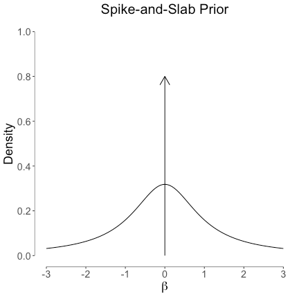
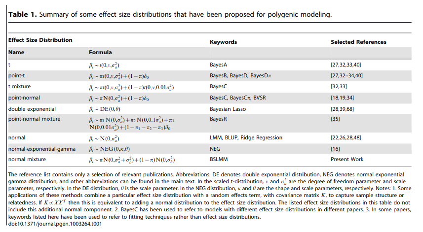

```{r, include = FALSE}
library(pacman)
p_load(data.table, ggplot2, rrBLUP, lattice, brms, knitr, plotly, prettydoc, lubridate, DT, lsmeans, car, htmltools, pander, tidyverse, knitr)
interactive = FALSE
```

```{r klippy, echo=FALSE, include=TRUE}
klippy::klippy(position = c('top', 'right'))
```

```{r global_options, include=FALSE}

######################
### General Config ###
######################

knitr::opts_chunk$set(fig.width=12, fig.height=8, fig.path='Figs/',
		      echo=FALSE, warning=FALSE, message=FALSE, include = FALSE, eval = TRUE)

fontSize = 15

```


# Genomic Prediction

Genomic Prediction entails methods to predict breeding values bases on phenotypic
and molecular (SNP) data.
The general concept is that the breeding value of an individual can be recovered by
a linear regression on its genotype scores, i.e.

$$
\mathbf{\hat{g}} = \mathbf{M}\mathbf{\hat{a}},
$$

where $\mathbf{M}$ is a matrix of genotype scores in {0,1,2} coding, denoting the copies
of the major allele of SNP markers, the individual carries, and $\mathbf{\hat{a}}$ is a vector
of average allele effects for those markers.

The estimated breeding values ($\mathbf{\hat{g}}$, EBV) is then the sum of all the average allele
effects for the marker alleles the individual carries.

# Ridge Regression BLUP

The average allele effects can be estimated directly in a mixed effects model, treating the matrix of
marker covariates as random effects:

$$
\mathbf{y} = \mu + \mathbf{M}\mathbf{{a}} + \mathbf{e}
$$

If the individuals in $\mathbf{M}$ are not representative of the general population (if they are top ranking
individuals only, for example), we have to adjust the breeding values obtained from the marker effects
by the population mean. In genomics, the population mean can be descriped by the allele frequencies
in the general population:

$$
p_i =  \frac{\sum_{i = 1}^{p}  m_{b_i}}{n},
$$

where $p_i$ denotes the allele frequency of the general population at marker $i$ and $m_{b_i}$ are the marker
covariates at marker $i$ of the general population.
Oftentimes, $\mathbf{M}$ is used as being representative of the general population, which is ususally not the case.

In order to adjust the EBVs from a genomic prediction model to represent the deviations from the population mean,
we subtract the average EBV of that population:

$$
\mathbf{\hat{g}} = \mathbf{M}\mathbf{\hat{a}} - 2\mathbf{p}\mathbf{\hat{a}}
$$

# GBLUP - an equivalent Ridge Regression Animal Model

Instead of doing regression on the marker covariates directly,
we can also generate a Gaussian Kernel from those covariates. That kernel
is commonly referred to as the genomic relationship matrix, and we obtain it
like this:

$$
\mathbf{G} = \frac{\bar{\mathbf{M}}\bar{\mathbf{M}}'}{tr(\bar{\mathbf{M}}\bar{\mathbf{M}}') / n},
$$

where $\bar{\mathbf{M_i}} = \mathbf{M_i} - 2p_i$. The centering of the genotypes guarantees that our
EBVs reflect a deviation from the general population, and the scaling (division by $tr(\bar{\mathbf{M}}\bar{\mathbf{M}}') / n}$)
that our estimated variance components mimic an additive genetic variance.

The GBLUP model then becomes:

$$
\mathbf{y} = \mu + \mathbf{g} + \mathbf{e}
$$,

with $\mathbf{g} \sim MVN(0, \mathbf{G}\sigma_{g}^{2}$).

It is important to note that both models, the ridge regression marker model and GBLUP are statistically
identical and result in the same EBVs. So we can chose the model that is most convenient to fit
computationally.


# GBLUP examples in R

First we will be preparing a common dataset for the upcoming excercises

```{r brms_mean, include = TRUE, echo = TRUE, eval = TRUE}
if(!require(brms)) install.packages('brms')
if(!require(BGLR)) install.packages('BGLR')
if(!require(rrBLUP)) install.packages('rrBLUP')
library(brms)
library(BGLR)
library(rrBLUP)
library(ggplot2)
library(knitr)
library(lattice)

# load the "wheat" data set from BGLR
data(wheat)

# extract one phenotype
y = wheat.Y[,1]

# the marker covariates
M = wheat.X

# average allele frequencies ("p")
p = colMeans(M) / 2

# center our Marker covariates
Mc = sweep(
	   x = M, 
	   MARGIN = 2,
	   FUN = "-",
	   STATS = 2 * p
	   )

# compute G matrix
MMdash = Mc %*% t(Mc)
G = MMdash / mean(diag(MMdash))

# look at genomic relationships
levelplot(G)
```

With the basic dataset established, we now have many options to fit the ridge regression marker
or GBLUP model. 

## Ridge Regression Marker Model
```{r rrblup, include = TRUE, echo = TRUE, eval = TRUE}
# design matrix for random effects (marker covariates become design matrix)
Z = Mc

# design matrix for fixed effects (only intercept)
X = array(1, dim = c(length(y), 1))

# fit the model with ML
mod_rr = mixed.solve(
		     y = y, 
		     X = X, 
		     Z = Z,
		     method = "ML"
		     )

# extract marker effects
a_rr = mod_rr$u

# predict breeding values from the model
g_rr = as.numeric(Z %*% a_rr)

# extract variance components
var_a_rr = mod_rr$Vu
var_e_rr = mod_rr$Ve

# we get the "additive genetic" variance, by rescaling the variance component for 
# the marker effects
var_g_rr = mod_rr$Vu * mean(diag(MMdash))
```

## GBLUP Model
```{r gblup, include = TRUE, echo = TRUE, eval = TRUE}
# fit the model with ML
mod_gblup = mixed.solve(
		     y = y,
		     K = G, # here we pass the genomic relationship matrix as kernel
		     method = "ML"
		     )

# extract breeding values
g_gblup = mod_gblup$u

# obtain marker effects from a GBLUP model
MMdash_tmp = MMdash
diag(MMdash_tmp) = diag(MMdash_tmp) + 0.00001
a_gblup = as.numeric(t(Mc) %*% solve(MMdash_tmp, g_gblup))

# extract variance components
var_g_gblup = mod_gblup$Vu
var_e_gblup = mod_gblup$Ve
```

## Check equivalence of models

```{r check_equivalence, include = TRUE, echo = TRUE, eval = TRUE}
# plot breeding values from both models
plot(g_rr, g_gblup)

# plot marker effects from both models
plot(a_rr, a_gblup)

# some summaries
summary(lm(g_rr ~ g_gblup))
summary(lm(a_rr ~ a_gblup))

# variance components and heritabilities
vc = rbind(
	       data.frame(
		      model = "Marker Model",
		      var_g = var_g_rr,
		      var_e = var_e_rr,
		      h2 = var_g_rr / (var_g_rr + var_e_rr)
		      ),
	       data.frame(
		      model = "GBLUP",
		      var_g = var_g_gblup,
		      var_e = var_e_gblup,
		      h2 = var_g_gblup / (var_g_gblup + var_e_gblup)
		      )
	       )

kable(vc, digits = 3)
```

## Cross Validation

In order to assess the performance of our genomic prediction models, we can
run a cross validation scheme, in which we train marker effects with a subset
of the data and predict the EBVs of the left out samples based on the training model.

```{r cv, include = TRUE, echo = TRUE, eval = TRUE}
# define function to create cross validation samples
cCV <- function(y, folds=5, reps=1, matrix=FALSE, seed=NULL) {

	if(!is.vector(y)) stop("y must be a vector")
	if(folds < 2) stop("'folds' must be larger than one")
	if(reps < 1) reps = 1

	reps = as.integer(reps)
	folds = as.integer(folds)

	isy <- (1:length(y))[!is.na(y)]

	n_vec <- rep(NA,folds)
	start <- rep(NA,folds)
	end <- rep(NA,folds)

	n_vec[1:(folds-1)] <- round(length(isy)/folds,digits=0)
	n_vec[folds] <- length(isy) - sum(n_vec[1:(folds-1)])


	for(j in 1:folds) {

		if(j==1) {

			start[j] = 1

		} else {

			start[j] = end[j-1]+1

		}

		end[j] = sum(n_vec[1:j])
	}

	count=0
	cv_pheno <- list(folds*reps)

	if(missing(seed)) seed = as.integer((as.double(Sys.time())*1000+Sys.getpid()) %% 2^31)
	set.seed(seed)

	for(i in 1:reps) {

		ids <- sample(isy,length(isy),replace=F)

		for(j in 1:folds) {

			count=count+1
			y_temp = y
			y_temp[ids[start[j]:end[j]]] <- NA
			cv_pheno[[count]] <- y_temp

		}

	}


	if(matrix) {

		return(matrix(unlist(cv_pheno),nrow=length(y),ncol=length(cv_pheno),byrow=FALSE))

	} else {

		return(cv_pheno)

	}

}

# create 5 fold cross validation samples
cvs = cCV(y, folds = 5, reps = 1)

# run cross validation
pred = rep(as.numeric(NA), length(y))
for(i in 1:length(cvs)) pred[is.na(cvs[[i]])] = mixed.solve(y = cvs[[i]], K = G)$u[is.na(cvs[[i]])]

# plot predictes vs observed
plot(pred, y)

# prediction accuracy
cor(pred, y)

# check bias
summary(lm(pred ~ y))
```

# Bayesian Alphabet

A linear mixed model with a series of independent random effects has the following form:

$$
\mathbf{y} = \mathbf{X\boldsymbol{\beta}} + \mathbf{Z}_{1}\mathbf{u}_1 + \mathbf{Z}_{2}\mathbf{u}_2 + \mathbf{Z}_{3}\mathbf{u}_3 + \dots + \mathbf{Z}_{k}\mathbf{u}_{k} + \mathbf{e},
$$

with the joint posterior density

$$
\begin{aligned}
p(\boldsymbol{\beta},\sigma_{\beta}^2,\mathbf{u}_{1},\sigma_{u_1}^2,\dots,\mathbf{u}_{k},\sigma_{u_{k}}^2, \sigma_{\epsilon}^2 | \mathbf{y}) 
&\propto \left\{\prod_{i=1}^{n}N(y_i | \mathbf{x}_{i}' \boldsymbol{\beta} + \sum_{j=1}^{k} \mathbf{z}_{j_i}' \mathbf{u}_{j}, \sigma_{\epsilon}^2) \right\} \\ 
&\times N(\boldsymbol{\beta}|0,\mathbf{I}\sigma_{\beta}^2) \prod_{j=1}^{k}N(\mathbf{u}_{j} | 0,\mathbf{I}\sigma_{j}^2) \\
&\times \prod_{j=1}^{k} \chi^{-2}(\sigma_{j}^2 | S_{j}, df_{j}) \chi^{-2}(\sigma_{\epsilon}^2 | S_{\epsilon}, df_{\epsilon}).
\end{aligned}  
$$

In the Bayesian Alphabet, the prior distributions on the marker effects is altered to generally generate a sparsity pattern on the
marker effects, meaning feature selection.
This feature selection is achieved by using *spike-and-slap* mixture priors. Those priors have a point mass at zero and a 
usually normal slap. Noisance marker effects ideally get absorbed in the point mass at zero, whereas relevant markers 
have a higher mixture probability for the slap, and get a significan effect size.



{https://fabiandablander.com/r/Spike-and-Slab.html}



{https://xzlab.org/papers/2013_Zhouetal_PG.pdf}

# $BayesC\pi$ - Threshold Model

Binary Traits (0/1) can be modelled with generalized linear models in which the expectation of the observations
are mapped to a linear predictor comprised of random and fixed effects.
The likelihood for the data is a Bernoulli distribution in our case, with success probably linked to
the linear predictor through the probit function.

$$
\begin{aligned}
\mathbf{y} &\sim \mathbf{B}(1,\mathbf{p})\\
\mathbf{p} &= probit(\mathbf{X}\boldsymbol{\beta} + \mathbf{Zu}) \\
\boldsymbol{\beta} &\sim \mathbf{U}(-Inf,Inf) \\
\mathbf{u} &\sim \pi N(0,{\sigma_u}^2) + (1-\pi)\delta_0 \\
\pi &\sim U(0,1) \\
{\sigma_u}^2 &\sim Gamma(1,0.01)
\end{aligned}
$$

The following shows an implmementation of that model in [Jags](https://mcmc-jags.sourceforge.io/):


```{r bayesc, include = TRUE, echo = TRUE, eval = TRUE}
if (!require("rjags")) install.packages("rjags")
library(rjags)

BayesCJags <- function(y, Z, threshold = FALSE, niter = 5000, burnin = 2500, betaPriorAlpha = 2, betaPriorBeta = 5) {


	###############################
	### First the model strings ###
	###############################

	# probit threshold model
	modelstringThreshold = "
	model {
		for (i in 1:n) {
			y[i] ~ dbern(prob[i])
			probit(prob[i]) <- alpha + inprod(X[i,],beta)
		}
		for (j in 1:p) {
			ind[j] ~ dbern(pind)
			betaT[j] ~ dnorm(0,tau)
			beta[j] <- ind[j] * betaT[j]
		}
		tau ~ dgamma(1,0.001)
		alpha ~ dnorm(0,0.0001)
		# pind ~ dunif(0,1)
		pind ~ dbeta(betaPriorAlpha, betaPriorBeta)
	}
	"

	# and the gaussian model
	modelstringGaussian = "
	model {
		for (i in 1:n) {
			y[i] ~ dnorm(alpha + inprod(X[i,],beta), tauE)
		}
		for (j in 1:p) {
			ind[j] ~ dbern(pind)
			betaT[j] ~ dnorm(0,tauB)
			beta[j] <- ind[j] * betaT[j]
		}
		tauB ~ dgamma(1,0.001)
		alpha ~ dnorm(0,0.0001)
		# pind ~ dunif(0,1)
		pind ~ dbeta(betaPriorAlpha, betaPriorBeta)
		tauE ~ dgamma(1, 0.001)
	}
	"

	# the default (gaussian)
	modelstring <- modelstringGaussian

	if(threshold) {

		modelstring = modelstringThreshold

	}


	# some checks
	if(!(is.numeric(y) | is.numeric(y) | is.vector(y))) stop("y must be a numeric/integer vector")
	if(threshold & length(unique(y)) > 2) stop("y must be 0/1 for the threshold model")

	if(!is.matrix(Z)) stop("Z must be a numeric matrix")
	if(nrow(Z) != length(y)) stop("Z must have as many rows as elements in y")

	# make the data.frame
	n = length(y)
	p <- ncol(Z)

	data = list(y = y, X=Z ,n = n,p = p, betaPriorAlpha = betaPriorAlpha, betaPriorBeta = betaPriorBeta)
	init = list(alpha = 0, betaT = rep(0,p), pind = 0, ind = rep(0,p), tauB = 1)
	if(!threshold) init$tauE = 1

	load.module("glm")
	model = jags.model(textConnection(modelstring),
			   data = data, inits = init)

	# burnin
	update(model, n.iter = burnin)

	# sampling
	output = coda.samples(model = model,
			      variable.names = names(init),
			      n.iter = (niter - burnin), thin = 1)

	return(output)

}

# create "binary" trait from our phenotypes
mu_y = mean(y)
y_binary = rep(0, length(y))
y_binary[y > mu_y] = 1

Mc_small = Mc[, 1:50]

# run model
# mod_bcpi <- BayesCJags(y = y_binary, Z = Mc_small, threshold = TRUE, niter = 500, burnin = 250, betaPriorAlpha = 2, betaPriorBeta = 5)

# gaussian response
# mod_bcpi_gaussian <- BayesCJags(y = y, Z = Mc_small, threshold = FALSE, niter = 500, burnin = 250, betaPriorAlpha = 2, betaPriorBeta = 5)
```
