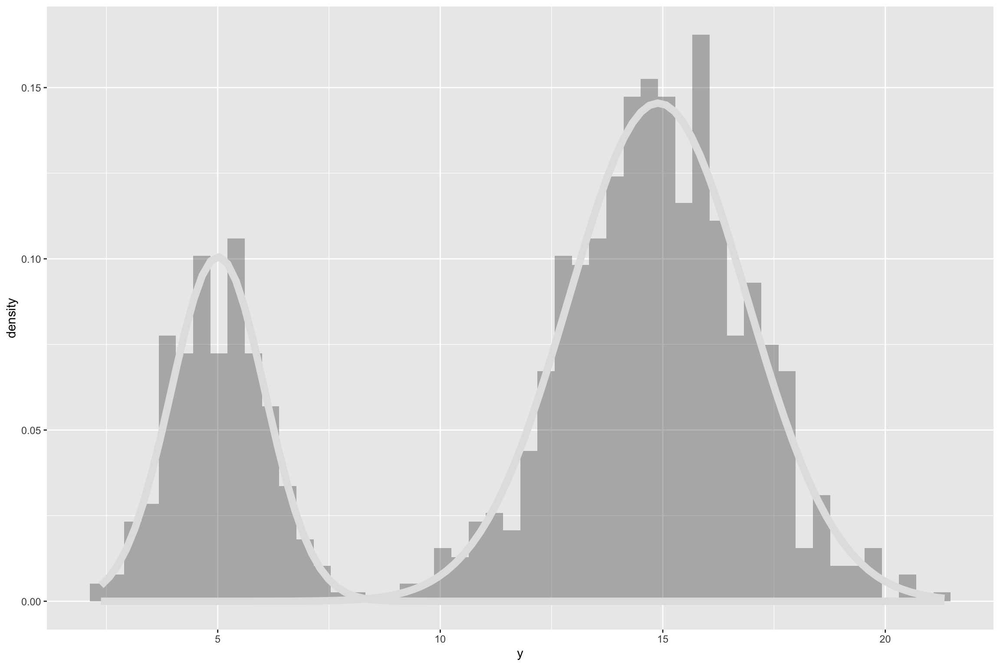
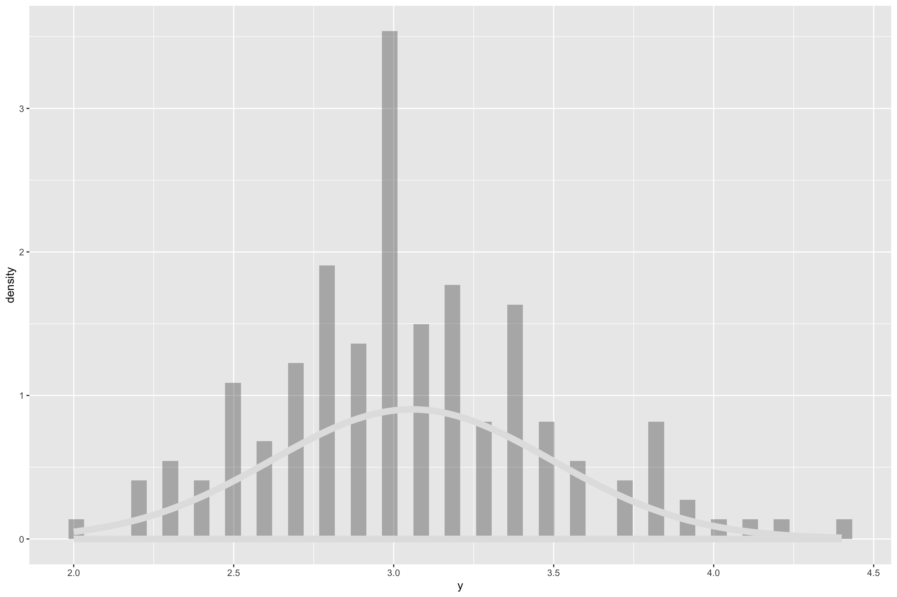
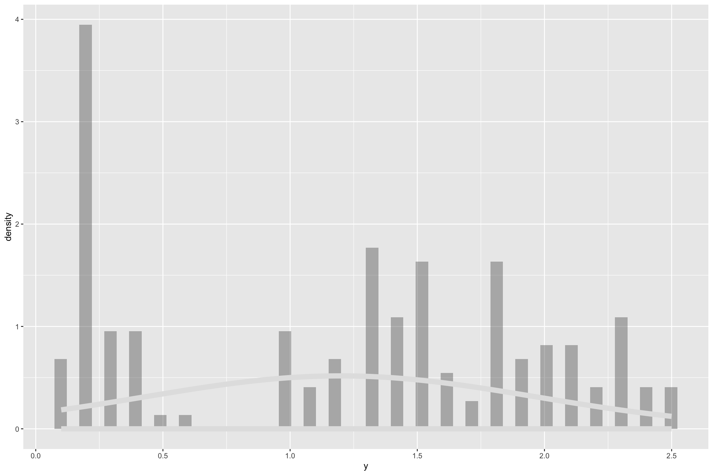
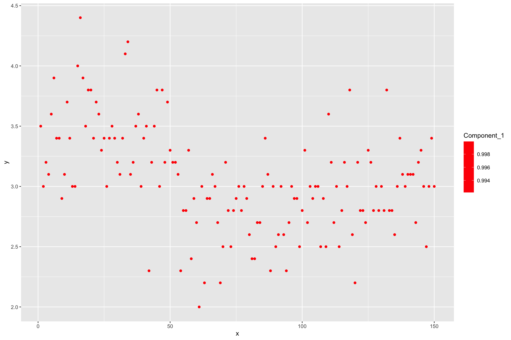
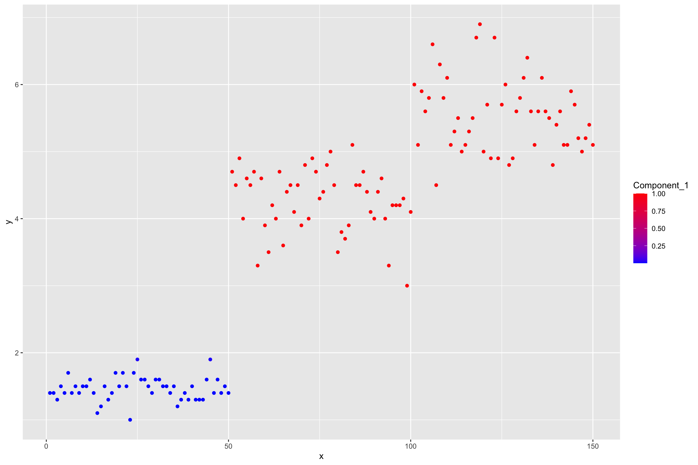
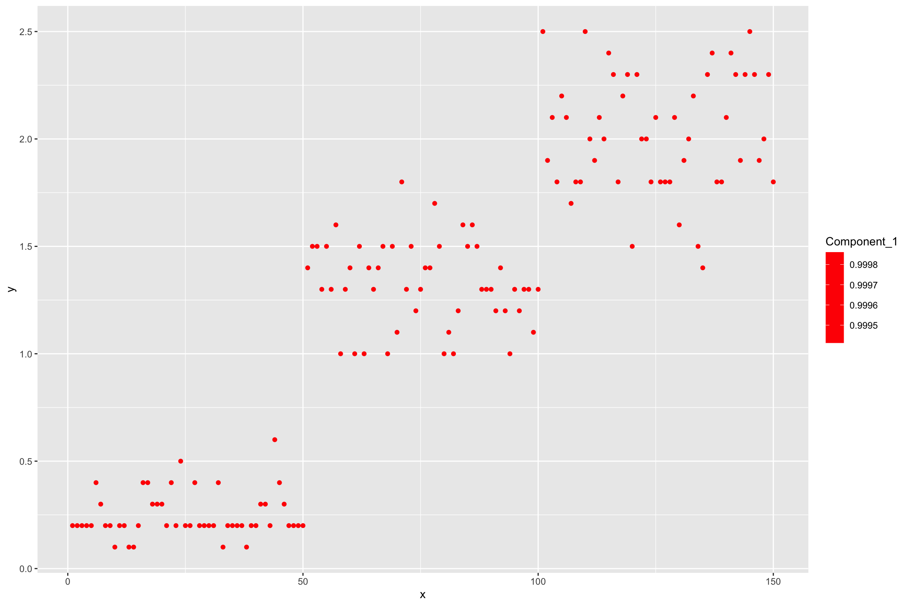
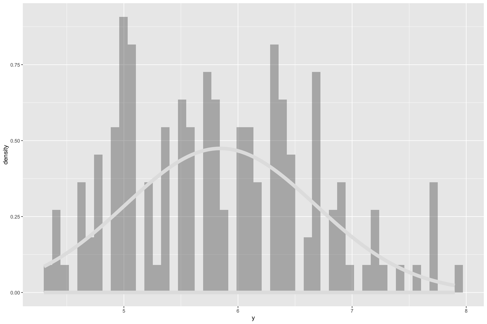
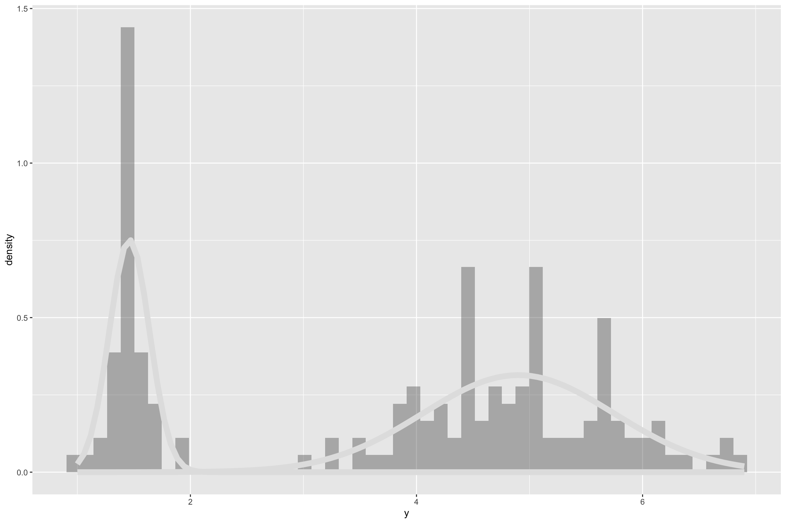

<div class="view-switch"><a href="../lectures/clustering.html">Open slides</a></div>

```{r}
#| include: false
library(ggplot2)
library(knitr)

theme_set(theme_minimal(base_size = 13))
```

# Clustering

Clustering or *Unsupervised Learning* deals with learning grouping structures from *unlabelled*
data.

Unlabelled data means the absense of trait or phenotypic observations in a breeding context while having *features* available
on a set of individuals.

Illustration on a dataset that contains *features* and *labels*. The features here are `Sepal.Length`,`Sepal.Width`,`Petal.Length` and `Petal.Width`.
The labels for those feature observations are the `Species`. The labels therefore give us a grouping category in this case.

```{r labelled, eval=FALSE}
library(pacman)
p_load(ggplot2, knitr, plotly, lubridate, tidyverse, rstan)

# load dataset
data(iris)

# check out features and labels
glimpse(iris)
```

```{r}
data(iris)
kable(head(iris), digits = 2)
```

Now we treat the features as coming from unlabelled individuals, meaning we dont have information on the grouping factor (Species)

```{r unlabelled, eval=FALSE}
# load dataset
data(iris)

# check out features and labels
glimpse(iris %>% select(-Species))
```

```{r}
kable(head(iris[, c("Sepal.Length", "Sepal.Width", "Petal.Length", "Petal.Width")]), digits = 2)
```

Now we are left with a set of features without associated labels.
This is a common situation in clustering settings in which we try to infer
data structure from observed features while having non or questionable grouping labels.

## Univariate Clustering

An initial approach is to investigate the indivudal features in isolation from each other and
try to infer a grouping structure.

```{r univariate_plot, eval=FALSE}
dplot = pivot_longer(iris, -Species, names_to = "Feature", values_to = "Value")
p = ggplot(dplot, aes(x = Value)) +
  geom_histogram(aes(y = ..density.., fill = Feature), bins = 40) +
  geom_density(color = "#b3212d", linewidth = 1.1) +
  facet_wrap(~ Feature)
p
```

```{r}
dplot = stack(iris[, c("Sepal.Length", "Sepal.Width", "Petal.Length", "Petal.Width")])
colnames(dplot) = c("Value", "Feature")

ggplot(dplot, aes(x = Value)) +
  geom_histogram(
    aes(y = after_stat(density)),
    bins = 40,
    fill = "#d9e2e7",
    color = "#374151",
    linewidth = 0.25
  ) +
  geom_density(color = "#b3212d", linewidth = 1.1) +
  facet_wrap(~ Feature, scales = "free") +
  labs(x = "Value", y = "Density")
```

Some features indicate that the data had been generated not from a single normal process, but
potentially a series of processes. In that case, we can attempt to cluster the individual observations
by fitting a *normal mixture model* to one feature at a time.

$$
p(\mathbf{x}) = \sum_{i=1}^{K} \lambda_i f_i(\mathbf{x}), ~~~~~~ with \sum \boldsymbol{\lambda} = 1.
$$

Univariate normal distribution: $f(x) \sim N(\mu, \sigma^2)$,
$\mu$ is a single location parameter - the mean and
$\sigma^2$ is a common variance component.

### Implement the k-mixture model in Stan

```{r gauss_mixture_stan}
# some random data
set.seed(100)
N <- 1000

# mixture probability for the first component
theta <- 0.3
mu1 <- 5
mu2 <- 15
sd1 <- 1
sd2 <- 2
y <- ifelse(runif(N) < theta, rnorm(N, mu1, sd1), rnorm(N, mu2, sd2))

dat = list(
     N = length(y),
     y = y,
     k = 2 # number of mixture components
)

dplot = as.data.frame(dat)

# plot the raw data
ggplot(dplot, aes(x = y)) +
  geom_histogram(aes(y = ..density..), bins = 50, fill = "white", color = 1) +
  geom_density(color = "#b3212d", linewidth = 1.1)
```

```{r gauss_mixture_stan_only, eval=FALSE}
# stan program for mixture model of k normal distributions
hcode =
"
data {
    int<lower=1> N;
    int<lower=1> k;
    real y[N];
}
parameters {
    simplex[k] theta;
    real mu[k];
    real<lower=0> tau[k];
}
model {
    real ps[k];
    for (i in 1:k){
        mu[i] ~ normal(0, 1.0e+2);
    }
    for(i in 1:N){
        for(j in 1:k){
            ps[j] <- log(theta[j]) + normal_log(y[i], mu[j], tau[j]);
        }
        increment_log_prob(log_sum_exp(ps));
    }
    tau ~ cauchy(0,5);
}
"


hlm = stan(
     model_name = "Gauss mixture",
     model_code = hcode,
     data = dat,
     iter = 2000,
     warmup = 1500,
     verbose = FALSE,
     chains = 1
)

# extract the posteriors of our mixture components
out <- rstan::extract(hlm)

# posterior means
thetas = colMeans(out$theta)
mus = colMeans(out$mu)
sds = colMeans(out$tau)

# small function that gives us the probabilities of every data point to belonging
# of either of the mixture components
GetProbNormalMixture <- function(y, lambda, mu, sigma) {

  lik <- array(as.numeric(NA), dim = c(length(y), length(lambda)))
  for(i in 1:length(lambda)) lik[,i] <- lambda[i] * dnorm(y,mu[i],sigma[i])
  probs <- lik / rowSums(lik)
  return(probs)

}

# normal density times constant
dnormLambda <- function(x, lambda, mu , sigma) {

  return(lambda * dnorm(x, mu, sigma))

}


probs = GetProbNormalMixture(y = y,
           lambda = thetas,
           mu = mus,
           sigma = sds
           )

dplot = tibble(
         x = 1:length(y),
         y = y,
         prob_one = probs[,1],
         prob_two = probs[,2]
         )

# plot the raw data and color by probability of belonging to mixture component one
ggplot(dplot, aes(y = y, x = x)) +
  geom_point(aes(color = prob_one)) +
    scale_colour_gradient2(low = 'green', mid = 'blue', high = 'red')


p <- ggplot(dplot, aes(y))
p <- p + geom_histogram(aes(y = ..density..), bins = 50, alpha = 0.4)

# add the densitites of the components
colors = hcl.colors(n = length(thetas), palette = "Blue-Red")

# add the densities
for(i in 1:length(thetas)) {

  p <- p + stat_function(fun = dnormLambda,
             args = list(lambda = thetas[i], mu = mus[i], sigma = sds[i]), color = colors[i], size = 3)

}

p
```




### Apply the mixture model to the iris data

First, bring everything together into a function that we can call conviently on different data
and different number of mixture components

```{r gauss_mixture_stan_function, eval=FALSE}

# small function that gives us the probabilities of every data point to belonging
# of either of the mixture components
GetProbNormalMixture <- function(y, lambda, mu, sigma) {

  lik <- array(as.numeric(NA), dim = c(length(y), length(lambda)))
  for(i in 1:length(lambda)) lik[,i] <- lambda[i] * dnorm(y,mu[i],sigma[i])
  probs <- lik / rowSums(lik)
  return(probs)

}

# normal density times constant
dnormLambda <- function(x, lambda, mu , sigma) {

  return(lambda * dnorm(x, mu, sigma))

}


RunMixture = function(y, k = 2, niter = 2000, warmup = 1500, seed = NULL) {

# stan program for mixture model of k normal distributions
hcode =
"
data {
    int<lower=1> N;
    int<lower=1> k;
    real y[N];
}
parameters {
    simplex[k] theta;
    real mu[k];
    real<lower=0> tau[k];
}
model {
    real ps[k];
    for (i in 1:k){
        mu[i] ~ normal(0, 1.0e+2);
    }
    for(i in 1:N){
        for(j in 1:k){
            ps[j] <- log(theta[j]) + normal_log(y[i], mu[j], tau[j]);
        }
        increment_log_prob(log_sum_exp(ps));
    }
    tau ~ cauchy(0,5);
}
"

dat = list(
     N = length(y),
     y = y,
     k = k # number of mixture components
)


hlm = stan(
     model_name = "Gauss mixture",
     model_code = hcode,
     data = dat,
     iter = niter,
     warmup = warmup,
     verbose = FALSE,
     chains = 1,
     seed = seed
)

# extract the posteriors of our mixture components
out <- rstan::extract(hlm)

# posterior means
thetas = colMeans(out$theta)
mus = colMeans(out$mu)
sds = colMeans(out$tau)

mc = tibble(
      thetas = thetas,
      mus = mus,
      sds = sds
      )


probs = GetProbNormalMixture(y = y,
           lambda = thetas,
           mu = mus,
           sigma = sds
           )

dprobs = as.data.frame(probs)
colnames(dprobs) = paste("Component", 1:k, sep = "_")
dprobs$y = y
dprobs$x = 1:nrow(dprobs)

# plot the raw data and color by probability of belonging to mixture component one
p_raw = ggplot(dprobs, aes(y = y, x = x)) +
  geom_point(aes(color = Component_1)) +
    scale_colour_gradient2(low = 'green', mid = 'blue', high = 'red')


p <- ggplot(dprobs, aes(y))
p <- p + geom_histogram(aes(y = ..density..), bins = 50, alpha = 0.4)

# add the densitites of the components
colors = hcl.colors(n = length(thetas), palette = "Blue-Red")

# add the densities
for(i in 1:length(thetas)) {

  p <- p + stat_function(fun = dnormLambda,
             args = list(lambda = thetas[i], mu = mus[i], sigma = sds[i]), color = colors[i], size = 3)

}

print(p)

return(
       list(
      mc = mc,
      dprobs = dprobs,
      thetas = thetas,
      mus = mus,
      sds = sds,
      p_raw = p_raw,
      p_density = p
      )
       )

}
```

Now apply the function on the different features of the iris data

```{r gauss_mixture_stan_iris, eval=FALSE}

seed = 242151

# prepare data for stan run

# pick a feature
sl_mixture = RunMixture(iris$Sepal.Length, k = 2, seed = seed)
sw_mixture = RunMixture(iris$Sepal.Width, k = 2, seed = seed)
pl_mixture = RunMixture(iris$Petal.Length, k = 2, seed = seed)
pw_mixture = RunMixture(iris$Petal.Width, k = 2, seed = seed)

# check the different components
kable(sl_mixture$mc)
kable(sw_mixture$mc)
kable(pl_mixture$mc)
kable(pw_mixture$mc)

sl_mixture$p_raw
sw_mixture$p_raw
pl_mixture$p_raw
pw_mixture$p_raw

sl_mixture$p_density
sw_mixture$p_density
pl_mixture$p_density
pw_mixture$p_density
```




















