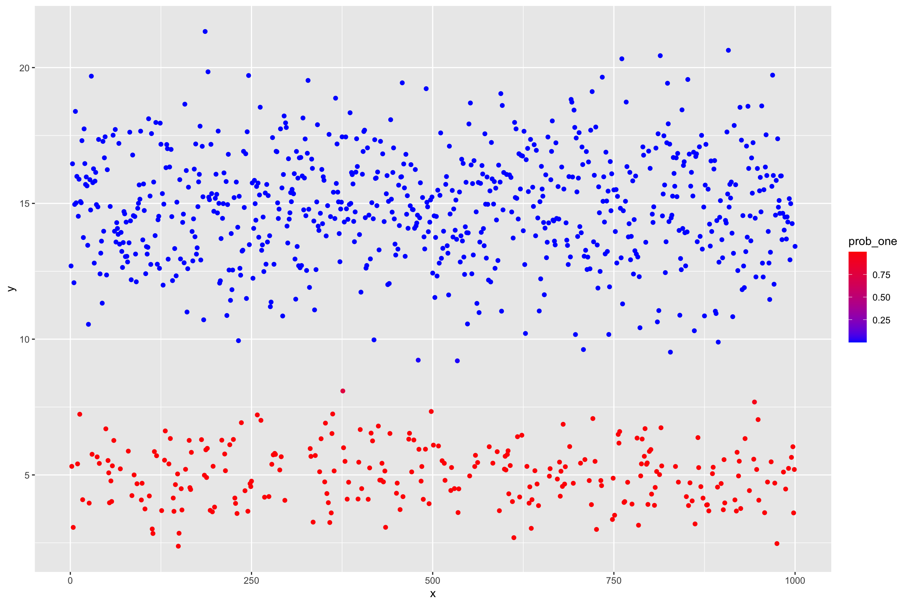
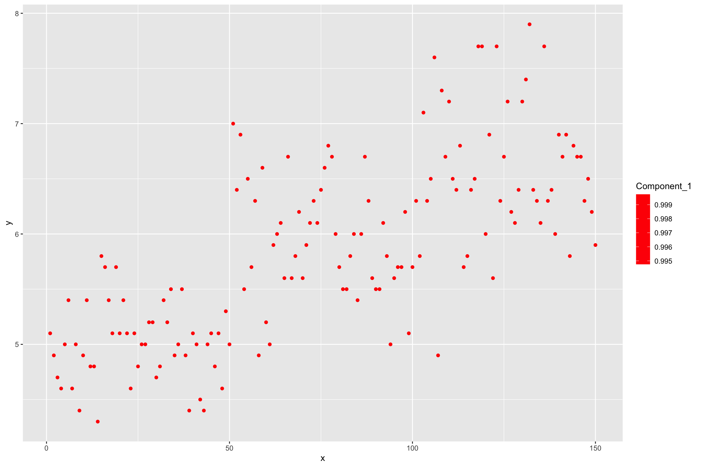

```{r}
#| include: false
mixture_preview <- function(y, k = 2, seed = 242151) {
  set.seed(seed)

  km <- kmeans(matrix(y, ncol = 1), centers = k, nstart = 25)
  center_order <- order(as.numeric(km$centers))
  cluster <- match(km$cluster, center_order)

  lambda <- as.numeric(tabulate(cluster, nbins = k)) / length(y)
  mu <- as.numeric(tapply(y, cluster, mean))
  sigma <- as.numeric(tapply(y, cluster, sd))

  grid <- seq(min(y) - sd(y), max(y) + sd(y), length.out = 400)

  do.call(
    rbind,
    lapply(seq_len(k), function(component) {
      data.frame(
        component = paste("Component", component),
        Value = grid,
        density = lambda[component] * dnorm(grid, mu[component], sigma[component])
      )
    })
  )
}
```

## Clustering

Clustering or *Unsupervised Learning* deals with learning grouping structures from *unlabelled*
data.

Unlabelled data means the absense of trait or phenotypic observations in a breeding context while having *features* available
on a set of individuals.

## Features And Labels

Illustration on a dataset that contains *features* and *labels*.

The features here are `Sepal.Length`,`Sepal.Width`,`Petal.Length` and `Petal.Width`.

The labels for those feature observations are the `Species`.

## Labelled Data

```{r eval=FALSE}
library(pacman)
p_load(ggplot2, knitr, plotly, lubridate, tidyverse, rstan)

# load dataset
data(iris)

# check out features and labels
glimpse(iris)
```

## Unlabelled Data

Now we treat the features as coming from unlabelled individuals, meaning we dont have information on the grouping factor (Species)

```{r eval=FALSE}
# load dataset
data(iris)

# check out features and labels
glimpse(iris %>% select(-Species))
```

## Univariate Clustering

An initial approach is to investigate the indivudal features in isolation from each other and
try to infer a grouping structure.

```{r eval=FALSE}
dplot = pivot_longer(iris, -Species, names_to = "Feature", values_to = "Value")
p = ggplot(dplot, aes(x = Value)) +
  geom_histogram(aes(y = ..density.., fill = Feature), bins = 40) +
  geom_density(color = "#b3212d", linewidth = 1.1) +
  facet_wrap(~ Feature)
p
```

## Feature Distributions {.code-tight}

```{r}
#| fig-show: hide
library(ggplot2)
data(iris)

dplot = stack(iris[, c("Sepal.Length", "Sepal.Width", "Petal.Length", "Petal.Width")])
colnames(dplot) = c("Value", "Feature")

feature_distribution_plot = ggplot(dplot, aes(x = Value)) +
  geom_histogram(
    aes(y = after_stat(density)),
    bins = 40,
    fill = "#d9e2e7",
    color = "#374151",
    linewidth = 0.25
  ) +
  geom_density(color = "#b3212d", linewidth = 1.1) +
  facet_wrap(~ Feature, scales = "free") +
  labs(x = "Value", y = "Density")

feature_distribution_plot
```

## Feature Distribution Plot

```{r}
#| echo: false
feature_distribution_plot
```

## Normal Mixture Model

Some features indicate that the data had been generated not from a single normal process, but
potentially a series of processes.

$$
p(\mathbf{x}) = \sum_{i=1}^{K} \lambda_i f_i(\mathbf{x}), ~~~~~~ with \sum \boldsymbol{\lambda} = 1.
$$

Univariate normal distribution: $f(x) \sim N(\mu, \sigma^2)$.

## Simulate Mixture Data {.code-tight}

```{r}
library(ggplot2)
theme_set(theme_minimal(base_size = 16))

# some random data
set.seed(100)
N <- 1000

# mixture probability for the first component
theta <- 0.3
mu1 <- 5
mu2 <- 15
sd1 <- 1
sd2 <- 2
y <- ifelse(runif(N) < theta, rnorm(N, mu1, sd1), rnorm(N, mu2, sd2))

dat = list(
     N = length(y),
     y = y,
     k = 2
)
```

## Raw Mixture

```{r}
dplot = as.data.frame(dat)

ggplot(dplot, aes(x = y)) +
  geom_histogram(aes(y = ..density..), bins = 50, fill = "white", color = 1) +
  geom_density(color = "#b3212d", linewidth = 1.1)
```

## Stan Mixture Program {.code-tight}

```{r eval=FALSE}
hcode =
"
data {
    int<lower=1> N;
    int<lower=1> k;
    real y[N];
}
parameters {
    simplex[k] theta;
    real mu[k];
    real<lower=0> tau[k];
}
model {
    real ps[k];
    for (i in 1:k){
        mu[i] ~ normal(0, 1.0e+2);
    }
    for(i in 1:N){
        for(j in 1:k){
            ps[j] <- log(theta[j]) + normal_log(y[i], mu[j], tau[j]);
        }
        increment_log_prob(log_sum_exp(ps));
    }
    tau ~ cauchy(0,5);
}
"
```

## Fit Mixture

```{r eval=FALSE}
hlm = stan(
     model_name = "Gauss mixture",
     model_code = hcode,
     data = dat,
     iter = 2000,
     warmup = 1500,
     verbose = FALSE,
     chains = 1
)

out <- rstan::extract(hlm)

thetas = colMeans(out$theta)
mus = colMeans(out$mu)
sds = colMeans(out$tau)
```

## Fitted Mixture Probabilities



## Fitted Mixture Densities {.code-tight}

```{r}
#| fig-show: hide
sim_density = rbind(
  data.frame(
    component = "Component 1",
    y = seq(min(y) - sd(y), max(y) + sd(y), length.out = 400),
    lambda = theta,
    mu = mu1,
    sigma = sd1
  ),
  data.frame(
    component = "Component 2",
    y = seq(min(y) - sd(y), max(y) + sd(y), length.out = 400),
    lambda = 1 - theta,
    mu = mu2,
    sigma = sd2
  )
)

sim_density$density = with(sim_density, lambda * dnorm(y, mu, sigma))

mixture_density_plot = ggplot(dplot, aes(x = y)) +
  geom_histogram(
    aes(y = after_stat(density)),
    bins = 50,
    fill = "#e8edf0",
    color = "#374151",
    linewidth = 0.25
  ) +
  geom_line(
    data = sim_density,
    aes(x = y, y = density, color = component),
    linewidth = 1.25,
    inherit.aes = FALSE
  ) +
  scale_color_manual(values = c("Component 1" = "#0b5cad", "Component 2" = "#b3212d")) +
  labs(x = "y", y = "Density", color = NULL)

mixture_density_plot
```

## Fitted Mixture Densities Plot

```{r}
#| echo: false
mixture_density_plot
```

## Mixture Probability Helper

```{r eval=FALSE}
GetProbNormalMixture <- function(y, lambda, mu, sigma) {

  lik <- array(as.numeric(NA), dim = c(length(y), length(lambda)))
  for(i in 1:length(lambda)) lik[,i] <- lambda[i] * dnorm(y,mu[i],sigma[i])
  probs <- lik / rowSums(lik)
  return(probs)

}

dnormLambda <- function(x, lambda, mu , sigma) {
  return(lambda * dnorm(x, mu, sigma))
}
```

## Apply To Iris

First, bring everything together into a function that we can call conviently on different data
and different number of mixture components.

```{r eval=FALSE}
RunMixture = function(y, k = 2, niter = 2000, warmup = 1500, seed = NULL) {
  # stan program, fit, posterior extraction, plots
}

seed = 242151

sl_mixture = RunMixture(iris$Sepal.Length, k = 2, seed = seed)
sw_mixture = RunMixture(iris$Sepal.Width, k = 2, seed = seed)
pl_mixture = RunMixture(iris$Petal.Length, k = 2, seed = seed)
pw_mixture = RunMixture(iris$Petal.Width, k = 2, seed = seed)
```

## Iris Mixture Densities {.code-tight}

```{r}
#| fig-show: hide
iris_features = iris[, c("Sepal.Length", "Sepal.Width", "Petal.Length", "Petal.Width")]

iris_density = do.call(
  rbind,
  lapply(names(iris_features), function(feature) {
    out = mixture_preview(iris_features[[feature]], k = 2, seed = 242151)
    out$Feature = feature
    out
  })
)

iris_long = stack(iris_features)
colnames(iris_long) = c("Value", "Feature")

iris_density_plot = ggplot(iris_long, aes(x = Value)) +
  geom_histogram(
    aes(y = after_stat(density)),
    bins = 40,
    fill = "#e8edf0",
    color = "#374151",
    linewidth = 0.25
  ) +
  geom_line(
    data = iris_density,
    aes(x = Value, y = density, color = component),
    linewidth = 1.15,
    inherit.aes = FALSE
  ) +
  scale_color_manual(values = c("Component 1" = "#0b5cad", "Component 2" = "#b3212d")) +
  facet_wrap(~ Feature, scales = "free") +
  labs(x = "Value", y = "Density", color = NULL)

iris_density_plot
```

## Iris Mixture Densities Plot

```{r}
#| echo: false
iris_density_plot
```

## Iris Mixture Probabilities



## Inspect Components

```{r eval=FALSE}
kable(sl_mixture$mc)
kable(sw_mixture$mc)
kable(pl_mixture$mc)
kable(pw_mixture$mc)

sl_mixture$p_raw
sw_mixture$p_raw
pl_mixture$p_raw
pw_mixture$p_raw

sl_mixture$p_density
sw_mixture$p_density
pl_mixture$p_density
pw_mixture$p_density
```
