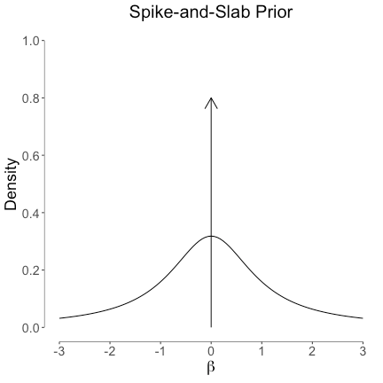
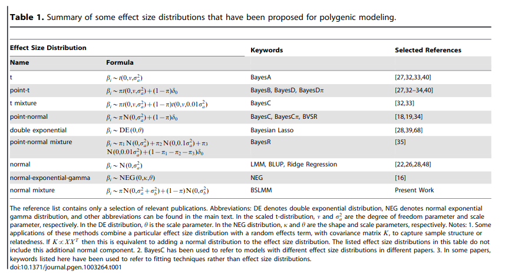

## Genomic Prediction

Genomic Prediction entails methods to predict breeding values based on phenotypic
and molecular (SNP) data.

$$
\mathbf{\hat{g}} = \mathbf{M}\mathbf{\hat{a}}
$$

where $\mathbf{M}$ is a matrix of genotype scores in {0,1,2} coding and $\mathbf{\hat{a}}$ is a vector
of average allele effects for those markers.

## Estimated Breeding Value

The estimated breeding value ($\mathbf{\hat{g}}$, EBV) is the sum of all the average allele
effects for the marker alleles the individual carries.

## Ridge Regression BLUP

The average allele effects can be estimated directly in a mixed effects model,
treating the them as random effects:

$$
\mathbf{y} = \mu + \mathbf{M}\mathbf{a} + \mathbf{e}
$$

## Center Marker Covariates

If the individuals in $\mathbf{M}$ are not representative of the general population,
we have to adjust the breeding values obtained from the marker effects
by the population mean.

$$
\mathbf{\hat{g}} = \mathbf{M}\mathbf{\hat{a}} - 2\mathbf{p}\mathbf{\hat{a}}
$$

## GBLUP

Instead of doing regression on the marker covariates directly,
we can also generate a Gaussian Kernel from those covariates.

$$
\mathbf{G} = \frac{\bar{\mathbf{M}}\bar{\mathbf{M}}'}{tr(\bar{\mathbf{M}}\bar{\mathbf{M}}') / n}
$$

## Equivalent Models

The GBLUP model becomes:

$$
\mathbf{y} = \mu + \mathbf{g} + \mathbf{e}
$$

with $\mathbf{g} \sim MVN(0, \mathbf{G}\sigma_{g}^{2})$.

Both models, the ridge regression marker model and GBLUP are statistically
identical and result in the same EBVs.

## Prepare Wheat Data

```{r}
library(BGLR)
library(rrBLUP)
library(ggplot2)
library(knitr)
library(lattice)
theme_set(theme_minimal(base_size = 16))

# load the "wheat" data set from BGLR
data(wheat)

# extract one phenotype
y = wheat.Y[,1]

# the marker covariates
M = wheat.X

# average allele frequencies ("p")
p = colMeans(M) / 2
```

## Genomic Relationship Matrix

```{r}
# center our Marker covariates
Mc = sweep(
     x = M,
     MARGIN = 2,
     FUN = "-",
     STATS = 2 * p
     )

# compute G matrix
MMdash = Mc %*% t(Mc)
G = MMdash / mean(diag(MMdash))

# look at genomic relationships
levelplot(G)
```

## Ridge Regression Marker Model

```{r}
# design matrix for random effects (marker covariates become design matrix)
Z = Mc

# design matrix for fixed effects (only intercept)
X = array(1, dim = c(length(y), 1))

# fit the model with ML
mod_rr = mixed.solve(
         y = y,
         X = X,
         Z = Z,
         method = "ML"
         )
```

## Marker Effects And EBV

```{r}
# extract marker effects
a_rr = mod_rr$u

# predict breeding values from the model
g_rr = as.numeric(Z %*% a_rr)

# extract variance components
var_a_rr = mod_rr$Vu
var_e_rr = mod_rr$Ve

# rescale the marker-effect variance component
var_g_rr = mod_rr$Vu * mean(diag(MMdash))
```

## GBLUP Model

```{r}
# fit the model with ML
mod_gblup = mixed.solve(
         y = y,
         K = G,
         method = "ML"
         )

# extract breeding values
g_gblup = mod_gblup$u
```

## Marker Effects From GBLUP

```{r}
MMdash_tmp = MMdash
diag(MMdash_tmp) = diag(MMdash_tmp) + 0.00001
a_gblup = as.numeric(t(Mc) %*% solve(MMdash_tmp, g_gblup))

# extract variance components
var_g_gblup = mod_gblup$Vu
var_e_gblup = mod_gblup$Ve
```

## Check Equivalence

```{r}
# plot breeding values from both models
plot(g_rr, g_gblup)

# plot marker effects from both models
plot(a_rr, a_gblup)
```

## Variance Components

```{r}
vc = rbind(
       data.frame(
        model = "Marker Model",
        var_g = var_g_rr,
        var_e = var_e_rr,
        h2 = var_g_rr / (var_g_rr + var_e_rr)
        ),
       data.frame(
        model = "GBLUP",
        var_g = var_g_gblup,
        var_e = var_e_gblup,
        h2 = var_g_gblup / (var_g_gblup + var_e_gblup)
        )
       )

kable(vc, digits = 3)
```

## Cross Validation

In order to assess the performance of our genomic prediction models, we can
run a cross validation scheme, in which we train marker effects with a subset
of the data and predict the EBVs of the left out samples based on the training model.

## Cross-Validation Helper {.smaller}

```{r eval=FALSE}
cCV <- function(y, folds=5, reps=1, matrix=FALSE, seed=NULL) {

  if(!is.vector(y)) stop("y must be a vector")
  if(folds < 2) stop("'folds' must be larger than one")
  if(reps < 1) reps = 1

  reps = as.integer(reps)
  folds = as.integer(folds)

  isy <- (1:length(y))[!is.na(y)]

  n_vec <- rep(NA,folds)
  start <- rep(NA,folds)
  end <- rep(NA,folds)

  n_vec[1:(folds-1)] <- round(length(isy)/folds,digits=0)
  n_vec[folds] <- length(isy) - sum(n_vec[1:(folds-1)])

  for(j in 1:folds) {

    if(j==1) {
      start[j] = 1
    } else {
      start[j] = end[j-1]+1
    }

    end[j] = sum(n_vec[1:j])
  }

  count=0
  cv_pheno <- list(folds*reps)

  if(missing(seed)) seed = as.integer((as.double(Sys.time())*1000+Sys.getpid()) %% 2^31)
  set.seed(seed)

  for(i in 1:reps) {

    ids <- sample(isy,length(isy),replace=F)

    for(j in 1:folds) {
      count=count+1
      y_temp = y
      y_temp[ids[start[j]:end[j]]] <- NA
      cv_pheno[[count]] <- y_temp
    }
  }

  if(matrix) {
    return(matrix(unlist(cv_pheno),nrow=length(y),ncol=length(cv_pheno),byrow=FALSE))
  } else {
    return(cv_pheno)
  }

}
```

## Cross-Validation Fit

```{r eval=FALSE}
cvs = cCV(y, folds = 5, reps = 10)

preds = list()
for(i in 1:length(cvs)) {

  this_pred = mixed.solve(y = cvs[[i]], K = G)$u[is.na(cvs[[i]])]
  this_y = y[is.na(cvs[[i]])]
  preds[[i]] = data.frame(pred = this_pred, y = this_y)

}

cors = unlist(lapply(preds, function(x) cor(x$pred, x$y)))
```

## Bayesian Alphabet

A linear mixed model with a series of independent random effects has the following form:

$$
\mathbf{y} = \mathbf{X\boldsymbol{\beta}} + \mathbf{Z}_{1}\mathbf{u}_1 + \mathbf{Z}_{2}\mathbf{u}_2 + \mathbf{Z}_{3}\mathbf{u}_3 + \dots + \mathbf{Z}_{k}\mathbf{u}_{k} + \mathbf{e}
$$

## Spike-And-Slap

In the Bayesian Alphabet, the prior distributions on the marker effects is altered to generally generate a sparsity pattern on the
marker effects, meaning feature selection.

This feature selection is achieved by using *spike-and-slap* mixture priors.



## Priors



## $BayesC\pi$ - Threshold Model

$$
\begin{aligned}
\mathbf{y} &\sim \mathbf{B}(1,\mathbf{p})\\
\mathbf{p} &= probit(\mathbf{X}\boldsymbol{\beta} + \mathbf{Zu}) \\
\boldsymbol{\beta} &\sim \mathbf{U}(-Inf,Inf) \\
\mathbf{u} &\sim \pi N(0,{\sigma_u}^2) + (1-\pi)\delta_0 \\
\pi &\sim U(0,1) \\
{\sigma_u}^2 &\sim Gamma(1,0.01)
\end{aligned}
$$
