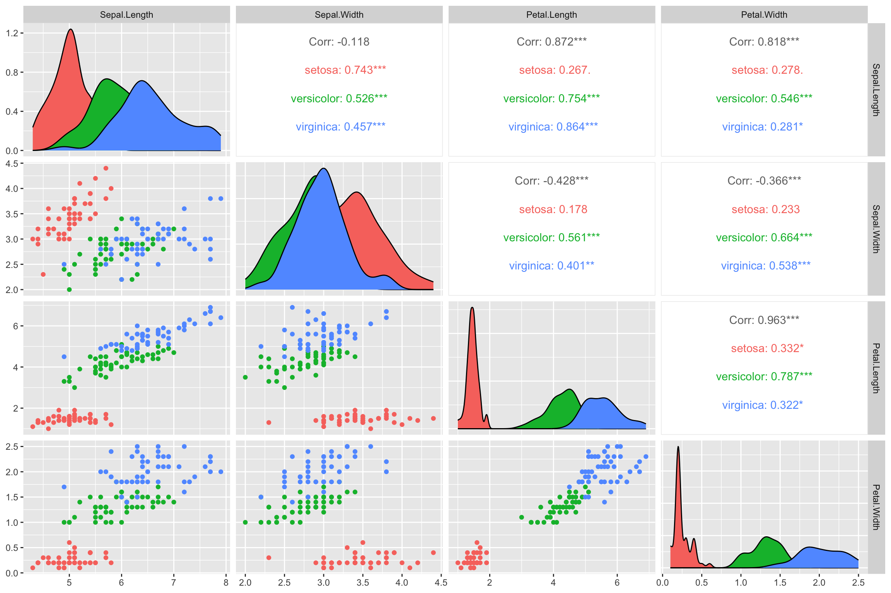

## Multivariate Clustering

Multivariate Clustering is the extension of univariate clustering (using only one feature for
identifying grouping categories), that makes use of more than one feature.

In the case of two features, we can apply the same logic of using mixture models to cluster
individuals into groups, only that now we fit a mixture of k multivariate normal distributions.

## Mixture Model

$$
p(\mathbf{x}) = \sum_{i=1}^{K} \lambda_i f_i(\mathbf{x}), ~~~~~~ with \sum \boldsymbol{\lambda} = 1.
$$

Multivariate normal distribution:

$$
f(\mathbf{x}) \sim MVN(\boldsymbol{\mu}, \Sigma)
$$

## Ellipses

In the bivariate case, the contours of the quntiles of the multivariate normal distributions
are *ellipses*.

The ellipse itself can be defined by the quantile which we want to establish, e.g. we want the area in which 95\% of the probability mass falls.

## Circle And Ellipse

$$
\begin{align}
Circle: & \frac{(x - \mu_x)^2}{r^2} + \frac{(y - \mu_y)^2}{r^2} = 1 \\
Ellipses: & \frac{(x - \mu_x)^2}{r_x^2} + \frac{(y - \mu_y)^2}{r_y^2} = 1 \\
\end{align}
$$

## Mahalanobis Distance

For the multivariate normal distribution, the squared distance of a data point to the mean in standard deviation units ($c^2)$ can be calculated as:

$$
(\mathbf{x} - \boldsymbol{\mu})'\Sigma^{-1}(\mathbf{x} - \boldsymbol{\mu}) = c^2.
$$

## Explore Pairwise Bivariate Data

Lets first visualize the features we have got available to the iris data set:

```{r eval=FALSE}
library(pacman)
p_load(ggplot2, knitr, plotly, lubridate, tidyverse, rstan, GGally, BGLR)

data(iris)

ggpairs(
  iris,
  columns = 1:4,
  aes(color = Species)
  )

iris_out = iris %>% select(x = Petal.Length, y = Petal.Width, Species)
```

## Pairwise Iris Features



## Fitting Mixture Of k Multivariate Normal

```{r eval=FALSE}
p_load(mixtools)

RunMixtureMVN = function(x, y, k = 2, labels = NULL, palette = "Dark 3") {

mod = mvnormalmixEM(x = cbind(x,y), k = k)

thetas <- mod$pro
mus <- mod$mu
V <- mod$sigma

if(is.null(labels)) labels = "1"

dplot = data.frame(
       x = x,
       y = y,
       prob = mod$posterior[,1],
       labels = labels
)
```

## Plot Mixture Ellipses

```{r eval=FALSE}
colors = hcl.colors(n = k, palette = palette)

p <- ggplot(dplot, aes(x = x, y = y)) +
  geom_point(alpha = 0.8, aes(color = prob))

p_label <- ggplot(dplot, aes(x = x, y = y)) +
  geom_point(alpha = 0.8, aes(color = labels))

for(i in 1:k) {

  ellipses <- ellipse(mu = mus[[i]], sigma = V[[i]], alpha = 1-0.999, npoints = 250, newplot = FALSE, draw = FALSE) %>%
    as.data.frame %>%
    rename(a = V1, b = V2)

  p = p + geom_point(data = ellipses, aes(x = a, y = b), color = colors[i], size = 0.8, shape = 8)
  p_label = p_label + geom_point(data = ellipses, aes(x = a, y = b), color = colors[i], size = 0.8, shape = 8)
}
```

## Bivariate Clustering Preview

```{r}
library(ggplot2)
theme_set(theme_minimal(base_size = 16))

iris_out = data.frame(
  x = iris$Petal.Length,
  y = iris$Petal.Width,
  Species = iris$Species
)

set.seed(2026)
km_iris = kmeans(iris_out[, c("x", "y")], centers = 2)
iris_out$cluster = factor(km_iris$cluster)

ggplot(iris_out, aes(x = x, y = y, color = cluster)) +
  geom_point(alpha = 0.8) +
  stat_ellipse(type = "norm", linewidth = 1) +
  labs(x = "Petal.Length", y = "Petal.Width", color = "Cluster")
```

## Run On Iris Data

```{r eval=FALSE}
mm_two = RunMixtureMVN(x = iris_out$x, y = iris_out$y, k = 2, labels = iris_out$Species)
mm_three = RunMixtureMVN(x = iris_out$x, y = iris_out$y, k = 3, labels = iris_out$Species)

mm_two$p
mm_two$p_label

mm_three$p
mm_three$p_label
```

## Principal Component Clustering

Principal Component Analysis (PCA) is a feature compression method, that
finds transformations of linearly independent features from the total set
that are ordered by their importance (variance explained).

$$
\mathbf{X} = \mathbf{USV'}
$$

## PCAs For Clustering

We will be computing the PCAs for a genotype data set, extract the first 2 components
and use them to cluster our data using a multivariate mixture model:

```{r eval=FALSE}
data(wheat)

M = wheat.X

pca = prcomp(M, scale = TRUE, center = TRUE)
spca = summary(pca)

plot(spca$importance[2,], ylab = "Proportion of Variance Explained")
plot(spca$importance[3,], ylab = "Cumulative Proportion")

ggplot(data.frame(x = pca$x[,1], y = pca$x[,2]), aes(x = x, y = y)) +
  geom_point() +
  xlab("PC1") +
  ylab("PC2")
```

## PCA Scatter

```{r}
library(BGLR)

data(wheat)

M = wheat.X
pca = prcomp(M, scale = TRUE, center = TRUE)

pca_scores = data.frame(
  PC1 = pca$x[,1],
  PC2 = pca$x[,2]
)

ggplot(pca_scores, aes(x = PC1, y = PC2)) +
  geom_point(alpha = 0.8) +
  labs(x = "PC1", y = "PC2")
```

## PCA Mixture

```{r eval=FALSE}
mm_pca = RunMixtureMVN(x = pca$x[,1], y = pca$x[,2], k = 2, palette = "Dark 3")

mm_pca$p
```

## K-Means

K-Means is a clustering technique that minimzes the following function:

$$
f(x) = \sum_{i = 1}^{k}\sum_{j = 1}^{nk}  (x_j - \mu_i)^2
$$

## K-Means In R

```{r eval=FALSE}
p_load(factoextra)

dat = iris %>% select(-Species)

dat = as.data.frame(M)

kmeans <- kmeans(M, centers = 2)

kplot = fviz_cluster(
         kmeans,
         data = dat,
         ggtheme = theme_minimal()
)

kplot
```

## K-Means Preview

```{r}
set.seed(2026)

kmeans_pca = kmeans(pca$x[,1:2], centers = 2)
pca_scores$cluster = factor(kmeans_pca$cluster)

ggplot(pca_scores, aes(x = PC1, y = PC2, color = cluster)) +
  geom_point(alpha = 0.8) +
  labs(x = "PC1", y = "PC2", color = "Cluster")
```
