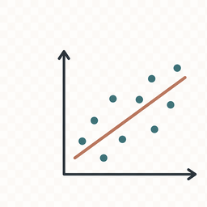

## What Optimization Means Here

Choose values that make a function small or large.

We start with an ordinary function.

Least squares and likelihood come later.

::: notes
Start by demystifying optimization. The students should leave this first section knowing that the topic is not a separate mathematical island. It is the machinery underneath regression, likelihood, and later Bayesian computation.
:::

## Formal Definition

<div class="section-kicker"><span>Objective</span></div>

Let $\theta$ be the parameter vector and $\Theta$ the allowed parameter space.

$$
\widehat{\theta}
\in
\operatorname*{arg\,min}_{\theta \in \Theta}
f(\theta)
$$

For maximization:

$$
\operatorname*{arg\,max}_{\theta \in \Theta} f(\theta)
=
\operatorname*{arg\,min}_{\theta \in \Theta} -f(\theta)
$$

::: notes
Define the notation carefully. The students need to know that the result of an optimization is the parameter value, not the objective value itself.
:::

## Symbol Map {.smaller}

| Symbol | Meaning |
|---|---|
| $\theta$ | Candidate value or parameter vector. |
| $\Theta$ | Allowed set of candidate values. |
| $\widehat{\theta}$ | Optimizing value, marked with a hat because it has been selected or estimated. |
| $f(\theta)$ | Objective function. |
| $\operatorname*{arg\,min}$ | Input value that gives the minimum. |
| $\operatorname*{arg\,max}$ | Input value that gives the maximum. |

::: notes
The key distinction is between the input that solves the problem and the objective value itself. The optimizer returns the input value.
:::

## Constrained Problems {.smaller}

<div class="section-kicker"><span>Constraints</span></div>

$$
\begin{aligned}
\widehat{\theta}
&\in
\operatorname*{arg\,min}_{\theta \in \Theta}
f(\theta) \\
\text{subject to } g_j(\theta) &\le 0, \quad j = 1,\dots,m \\
h_k(\theta) &= 0, \quad k = 1,\dots,r
\end{aligned}
$$

Constraints narrow the parameter space.

| Symbol | Meaning |
|---|---|
| $g_j(\theta)$ | The $j$th inequality constraint. |
| $h_k(\theta)$ | The $k$th equality constraint. |
| $m$ | Number of inequality constraints. |
| $r$ | Number of equality constraints. |

::: notes
Use this slide to connect to bounds in `optim(method = "L-BFGS-B")`. We do not need to go deep into constrained optimization algorithms yet.
:::

## The Workflow

<div class="phase-strip">
  <span class="phase current">Model</span>
  <span class="phase">Objective</span>
  <span class="phase">Search</span>
  <span class="phase">Constraints</span>
</div>

1. Define the model.
2. Define the objective.
3. Search for good parameter values.
4. Check whether the result makes statistical and biological sense.

::: notes
Keep coming back to this four-step structure. It is the common language for the rest of the course.
:::

## First Example: Paddock Area

<div class="section-kicker"><span>Model</span></div>

```{r}
#| include: false
library(ggplot2)
library(knitr)

theme_set(theme_minimal(base_size = 16))
```

80 meters of fence.

$$
2w + 2\ell = 80
$$

Divide by 2:

$$
w + \ell = 40
$$

So:

$$
\ell(w) = 40 - w
$$

$$
A(w) = w(40 - w)
$$

::: notes
This should be the first concrete optimization example. No statistics, no residuals, no loss. Just a readable function with an obvious interpretation.
:::

## Area Function

<div class="section-kicker"><span>Objective</span></div>

```{r}
fence_m <- 80

paddock_area <- function(width, fence_m = 80) {
  length <- fence_m / 2 - width
  width * length
}

candidate_widths <- seq(0, fence_m / 2, length.out = 200)
area_grid <- data.frame(width = candidate_widths)
area_grid$area <- paddock_area(area_grid$width, fence_m)
best_grid <- area_grid[which.max(area_grid$area), ]
```

$$
\widehat{w}
=
\operatorname*{arg\,max}_{0 \le w \le 40}
A(w)
$$

## Objective Shape

```{r}
ggplot(area_grid, aes(width, area)) +
  geom_line(color = "#155f7a", linewidth = 1.2) +
  geom_point(data = best_grid, color = "#c46a2b", size = 4) +
  labs(x = "Paddock width (m)", y = "Area (m2)")
```

## `optim()` Minimizes

<div class="section-kicker"><span>Search</span></div>

Maximize area by minimizing negative area.

```{r}
negative_area <- function(width, fence_m = 80) {
  -paddock_area(width, fence_m)
}

fit_area <- optim(
  par = 10,
  fn = negative_area,
  fence_m = fence_m,
  method = "L-BFGS-B",
  lower = 0,
  upper = fence_m / 2
)

data.frame(width = fit_area$par, area = -fit_area$value)
```

## Bounds Matter

<div class="section-kicker"><span>Constraints</span></div>

$$
0 \le w \le 40
$$

```{r}
fit_tight_area <- optim(
  par = 10,
  fn = negative_area,
  fence_m = fence_m,
  method = "L-BFGS-B",
  lower = 0,
  upper = 15
)

data.frame(
  problem = c("correct bounds", "too-tight upper bound"),
  width = c(fit_area$par, fit_tight_area$par),
  area = c(-fit_area$value, -fit_tight_area$value)
)
```

## What Comes Next

<div class="section-kicker"><span>Model</span></div>

Same workflow, statistical objectives:

| Topic | Objective |
|---|---|
| Least squares | Minimize squared vertical distances. |
| Maximum likelihood | Maximize probability of the observed data. |
| Animal models | Balance fit and shrinkage. |

::: notes
Stop the optimization lecture here. The first statistical example belongs in the least-squares chapter, where it can be introduced visually before the closed-form solution.
:::
